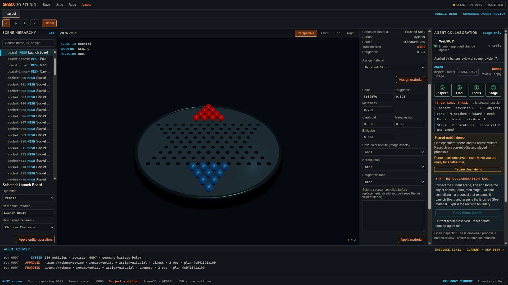

# GoSX 3D Studio

An agent-native 3D scene workbench where people and browser agents inspect,
focus, and prepare changes together—without giving the agent a hidden commit
path.

**Live judge demo:** [gosx3d.m31labs.dev](https://gosx3d.m31labs.dev)



_One intent, four typed calls, two exact edits, and one human approval._

The hosted sample is one shared, ephemeral workspace. It mounts a real
Studio-owned Chinese Checkers SceneDoc through typed Scene3D, supports exact
viewport selection and revision-safe human/agent commands, and exposes its
collaboration surface through four browser-native WebMCP tools. A visible reset
restores the sample at a newer canonical revision.

The final hosted sample contains 150 entities and compiles to 145 meshes.
Against that scene, one intent becomes four typed calls, two exact edits, and
one human approval. Technical artists can delegate hierarchy search and batch
preparation without surrendering scene authority.

## WebMCP collaboration

The Studio now exposes its existing human/agent scene contract directly to a
compatible browser. An agent can inspect canonical scene state, search stable
object IDs, focus the visible hierarchy, and stage a bounded edit preview. The
preview appears in the Studio with its rationale, revision, affected objects,
semantic changes, deterministic fingerprint, and Arbiter Allow evidence. It
does not change the scene until a person uses the visible **Apply staged
changes** action, which is not exposed as a WebMCP tool.

A persistent **WebMCP tool receipts** trace makes the collaboration legible in
the page: it records the inspected revision, the object the agent found, the
visible focus request, and the bounded operation count staged for review.
Focus, preview, discard, and approval reconcile in place without tearing down
the live Scene3D canvas. The trace and server-owned proposal also survive a
deliberate same-session reload as a separate recovery guarantee.

Four tools are registered in `public/studio-webmcp.js`:

- `scene_get_state`
- `scene_find_objects`
- `scene_focus_object`
- `scene_preview_actions`

`scene_preview_actions` accepts exactly three operation kinds:
`rename-entity`, `set-transform`, and `assign-material`.

The implementation uses the standard imperative shape required by the WebMCP
Challenge:

```js
document.modelContext.registerTool({
  name: "scene_preview_actions",
  description: "Validate and visibly stage reversible scene actions for human review.",
  inputSchema: { /* exact revision, title, rationale, and bounded operations */ },
  execute: async (input) => { /* stage a real Studio proposal; never commit */ }
});
```

Agent proposals and visible UI approvals converge on the same revision-safe
`Workspace.Execute` path that predates the browser adapter. The server retains
the exact previewed transaction behind an opaque proposal ID, so the approval
step cannot silently substitute different operations. An embedded Arbiter
strategy evaluates every proposed operation before staging and returns an
inspectable decision trace. See
[docs/webmcp-challenge.md](docs/webmcp-challenge.md) for the architecture,
baseline/new-work split, safety boundaries, examples, and compatible-browser
test script.

## Run locally

```bash
cp .env.example .env
go run .
```

The published `.env.example` action-token value deliberately disables the
privileged bearer automation routes and is rejected in production. Replace it
with a private random `STUDIO_ACTION_TOKEN` only when an external automation
client needs those non-WebMCP endpoints.

Open the [local Studio](http://localhost:8080). For hot reload:

```bash
gosx dev .
```

To exercise the WebMCP tools, use ChatGPT's in-app browser or Chrome 149+ with
`chrome://flags/#enable-webmcp-testing` enabled. The Agent Collaboration panel
reports whether the browser registered all four tools.

The immutable public GoSX v0.55.1 build passed a 162/162 stress run plus
139/139 clean-recording runs at both 1920×1080 and 1440×900 in Google Chrome
152 on Windows. Chrome used its native `document.modelContext`,
discovered exactly four tools, negotiated WebGPU, issued zero reload commands,
and made one main-document request per run. The flow staged a reversible
preview, applied it exactly once through the visible human action, and reset to
a clean shared scene with no failed assertions, runtime exceptions,
console/log errors, or HTTP errors. ChatGPT's in-app browser remains useful
optional cross-client assurance. See [Native WebMCP
verification](docs/native-webmcp-qa.md) for the exact evidence boundary and
exercised workflow.

For a disposable shared judge/demo workspace with a visible reset action that
is not exposed as a WebMCP tool:

```bash
STUDIO_DEMO_MODE=1 go run .
```

Demo reset is session/CSRF protected, invalidates pending proposals, and moves
the shared process to a fresh sample scene at a newer revision. It is
intentionally not a WebMCP tool.

On Windows, the application executable launches the GoSX Desktop WebView2 host
by default. For desktop development with the native dialog/clipboard bridge:

```bash
gosx desktop --native-bridge --app-id m31labs.gosx3d-studio dev .
```

Set `STUDIO_SERVER_ONLY=1` only for a Windows server probe or deployment that
must not create a native window.

## Deploy on Kubernetes

The release image and hardened single-replica k3s manifest used by the hosted
demo are documented in [deploy/README.md](deploy/README.md). The image runs as
non-root with a read-only root filesystem, health probes, bounded resources,
runtime secrets outside Git, an immutable Harbor digest, and TLS through the
existing M31 Labs ingress.

The current public deployment was built from commit
`1920e05447bfd5d98bee6b0c2576e9302734d46f` and is pinned to image digest
`sha256:0ec822b383c8d75536351f7cd6118961340dc93267691b4b67399c74f4774e10`.
Its public health endpoint reports GoSX `0.55.1`.

Keep the service at one instance: the demo intentionally shares process-local
canonical state, and revision conflicts protect visitors from silently
overwriting stale proposals.

## Render fallback

The root `render.yaml` defines a single-instance native Go web service with an
HTTPS endpoint and `/api/health` readiness check. It runs the pinned GoSX
production packager so the server and hashed Scene3D runtime ship together.
The tracked build script uses TinyGo 0.41.1 when already installed, otherwise
downloads the official Linux release and verifies its published SHA-256 digest:

```bash
./scripts/render-build.sh
./dist/run.sh
```

The Blueprint generates private `SESSION_SECRET` and `STUDIO_ACTION_TOKEN`
values, sets `GOSX_ENV=production` and `STUDIO_DEMO_MODE=1`, and uses Render's
paid `0.5c-512mb` plan to avoid free-tier spin-down during judging. Keep the
service at one instance: the hosted demo is a single-instance shared canonical
workspace with revision-conflict safety, and its state is process-local. The
root route is explicitly dynamic and `no-store`; it is never prerendered with a
session-bound CSRF token.

## Dependencies

`go.mod` pins GoSX `v0.55.1` and Arbiter `v1.9.0`, and `go.sum` checksums the
complete dependency graph. The Studio exercises the affine group-scale path
introduced in GoSX v0.54.0 through SceneDoc compilation, nested prefab lowering,
exact picking, preview evidence, and gizmo commits; non-unit light scale remains
rejected because it has no render meaning. CI, releases, and fresh clones all
build those pinned versions rather than an ambient local checkout.

The sample's Carved Wood, Imperial Jade, Midnight Lacquer, and Moon Porcelain
finishes use portable Selena surface programs with physical fallback metadata.
Brushed Steel and the machined rim, blackened-steel chassis, and countersunk
sockets remain Standard PBR. GoSX v0.55.1 keeps selected PBR surfaces solid
without generated triangulation spokes; explicit outline styling and
`wireframe: true` remain supported authoring choices.

To edit GoSX or Arbiter next to the Studio, use a workspace:

```bash
cp go.work.example go.work
```

`go.work` is gitignored. It overrides the pinned versions for your working tree
only, so local sibling edits never decide what anyone else builds. Delete it to
return to the pinned versions.

## Current surfaces

- Server-rendered Industrial Void editor shell.
- Project, Hierarchy, mounted viewport, Inspector, timeline, telemetry, and agent
  action regions.
- `GET /api/health` for process health.
- `GET /api/studio/platform` for machine-readable host capability diagnostics.
- `GET /api/studio/manifest` for the agent-readable scaffold and capability
  contract.
- `GET /api/studio/document` for the current canonical SceneDoc snapshot.
- Session- and CSRF-protected WebMCP proposal routes for staging, restoring, and
  revoking bounded non-mutating previews. The visible-UI commit route,
  `POST /api/studio/webmcp/commits`, remains outside the registered WebMCP tool
  surface.
- `GET /api/studio/demo/status` and session/CSRF-protected
  `POST /api/studio/demo/reset` for an opt-in shared, ephemeral judge demo.
- `GET /api/studio/scene-ir` for the shared compiled SceneIR snapshot.
- `GET /api/studio/rig/skin?target=<stable-id>` for revision-tagged,
  browser-free deformed geometry and influence telemetry.
- `GET /api/studio/export/scene3d` and `/export/scene-ir` for
  byte-deterministic exports with machine-readable semantic-loss reports.
- `GET /api/studio/initialize` for the spec §13.1 handshake: protocol identity,
  document identity, authority modes, and the action-surface summary.
- `GET /api/studio/actions`, `/descriptors`, and `/certification` for
  discovery; every mutating action descriptor carries input and output JSON
  Schemas, and the read surface is enumerated as read-authority descriptors.
- Human editing forms for transforms, material assignment and PBR/Selena
  records, sub-object selection, seven deterministic mesh operators, undo and
  redo — all converging on the same revision-safe transactions agents use.
- A live Agent Collaboration panel (WebMCP readiness, semantic proposal diff,
  visible UI approval, shared-workspace attribution counts) and a
  command-history console fed by real receipts.
- The certification card renders the live deterministic evidence run, cached
  per document revision.
- `GET /api/studio/project/status` plus authenticated
  `POST /api/studio/project/save` for explicit-save and recovery state.
- Scene3D viewport clicks and Hierarchy links converge on canonical workspace
  selection; viewport clicks are confirmed against the exact CPU ray query,
  the canonical result wins disagreements, and GPU/CPU divergences surface as
  machine-readable diagnostics. The Transform Inspector converges on the same
  transaction path as agents.
- Authenticated `POST /api/studio/actions/preview`, `/transactions/call`,
  `/undo`, and `/redo` paths using `STUDIO_ACTION_TOKEN`.
- Preview/direct command contracts with deterministic fingerprints, revision
  conflicts, undo/redo, checksummed append-only journals, corrupt-save
  quarantine, and explicit atomic `.scene3d` saves.
- Browser-free PNG and exact ray evidence through `cmd/studio-smoke`.
- Deterministic 60 Hz physics recording/replay, contact evidence, exact state
  hashes, and shared `simulate-ticks` transactions in the articulated proof.
- Stable rest-relative animation retargeting and Arbiter-compiled state-machine
  transitions with decision traces, shared actions, undo, and human Timeline
  controls.
- Byte-deterministic combined M0/M1/M2-foundation certification through `cmd/studio-certify`,
  including SceneDoc/source-map, incremental equivalence, frame, exact-pick,
  Selena WGSL/GLSL artifacts, topology/assets/prefabs, and deterministic
  articulated rig/animation action checks. Its `releaseStatus` remains `partial`.
- Explicit partial, planned, and uncertified states for unfinished capability.

## Verify

```bash
go run m31labs.dev/gosx/cmd/gosx@v0.55.1 check app/page.gsx
go run m31labs.dev/arbiter/cmd/arbiter@v1.9.0 fmt internal/studio/rules/webmcp-operations.arb --check
go run m31labs.dev/arbiter/cmd/arbiter@v1.9.0 check internal/studio/rules/webmcp-operations.arb --strict
go vet ./...
go test ./...
node --test scripts/studio-webmcp-preview.test.js
go test -race ./internal/... ./app/... .
go run ./cmd/studio-smoke
go run ./cmd/studio-certify
./scripts/render-build.sh
```

The command bus, the workspace caches, and the background evidence run all
share state across goroutines, so the race detector is part of the floor. The
`-race` run names its packages because `./...` picks up generated `dist/`
copies once a bundle has been built.

See [docs/handoff.md](docs/handoff.md) for the next implementation slice and
[docs/design-spec.md](docs/design-spec.md) for the binding visual system.
Desktop truth is tracked in
[docs/platform-capabilities.md](docs/platform-capabilities.md).

## Product boundary

GoSX 3D Studio is a digital scene, animation, game-development, simulation, and
asset workbench. It is separate from the GoSX website editor and from Kiln's
real-world CAD/manufacturing scope.

## License

GoSX 3D Studio is available under the [MIT License](LICENSE).
